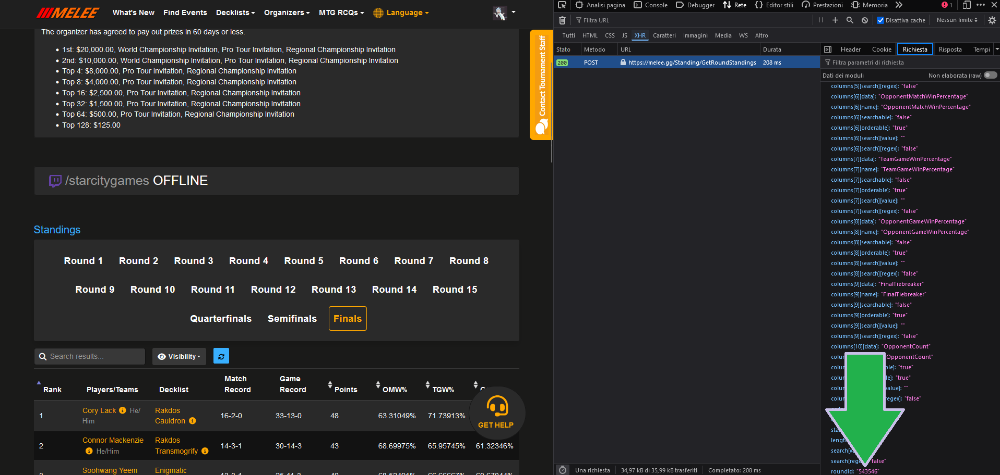

# MTG Data Miner ⛏️

PHP CLI application to extract data from MTG tournaments and calculate decks statistics.

🚧 Work In Progress 🚧

## Requirements

- PHP >= 8.1
- Composer
- melee.gg account

## Setup

- Run `composer install`
- Create a `.env` file
- Add `COOKIE=<copy-your-cookie-from-melee-request-headers>` to `.env`

## Commands

📝 You can find `lastRoundId` from melee.gg request

<details>
  <summary>Click to view image</summary>


</details>

Example from Regional Championship Washington DC: `543546`

### Tournament decks winrates

Command: `php app.php melee:tournament-winrates <lastRoundId>`

Example Output:
```
Azorius Control
WinRate: 53.05 %
Total Decks: 238

Izzet Phoenix
WinRate: 50.75 %
Total Decks: 196

Rakdos Aggro
WinRate: 51.3 %
Total Decks: 189

Enigmatic Incarnation
WinRate: 52.37 %
Total Decks: 117
```

### Tournament results list

Command: `php app.php melee:tournament-results <lastRoundId>`

Example Output:
```
Player: George Taylor
Deck: Boros Control
Wins: 3
Loses: 4
Draws: 0

Player: Joshua Stringer
Deck: Boros Midrange
Wins: 3
Loses: 4
Draws: 0

Player: Hope Beacom
Deck: Rakdos Midrange
Wins: 3
Loses: 4
Draws: 0

Player: Zach Fowler
Deck: Golgari Sacrifice
Wins: 3
Loses: 4
Draws: 0
```
